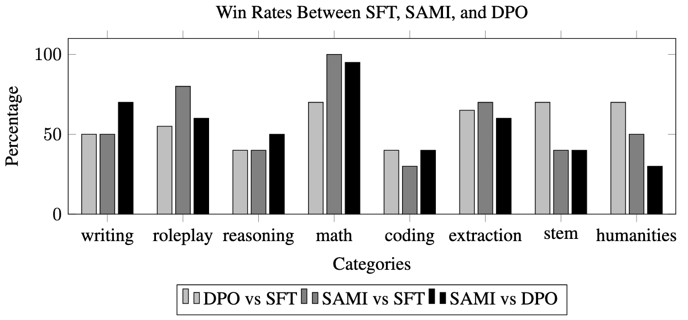
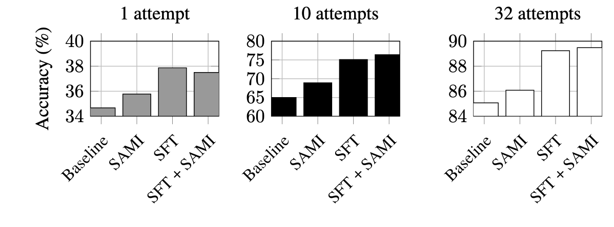
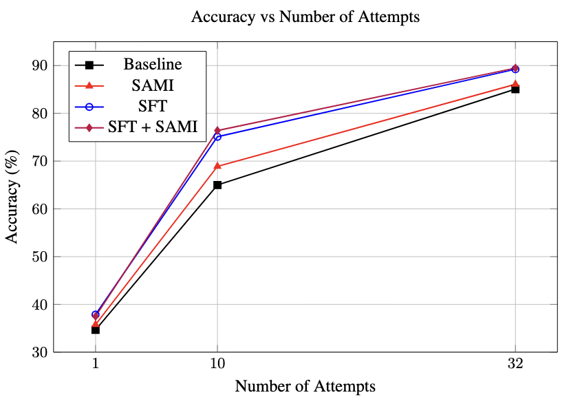

# An Exploration of Self-Supervised Mutual Information Alignment for Multi-Task Settings

This repository contains the code for "An Exploration of Self-Supervised Mutual Information Alignment for Multi-Task Settings". We build on the [initial SAMI reference repository](https://github.com/janphilippfranken/sami) to explore using SAMI for multi-task settings.

## Getting Started

1. Clone the repository with a depth of 1 to save space and time: `git clone --depth 1 https://github.com/sohamgovande/sami-extension.git`
2. Change the directory to the cloned repository: `cd sami-extension`
3. Create a new conda environment named 'sami' with Python version 3.10.0: `conda create -n sami python=3.10.0`
4. Activate the newly created conda environment: `conda activate sami`
5. Install the package in editable mode so that you can make changes to the code: `pip install -e .`

We successfully ran all data generation and training jobs on a machine with one NVIDIA A100 GPU. If you run into out-of-memory (OOM) errors, try reducing the batch size or use a smaller model. Empirically, we find that `mistral-7b` works well on A40 GPUs, and `mistral-tiny-base` works well on CPU-only hosts.

## 📚 Experiment 1: Multi-Task Learning with SAMI for MT-Bench

Folder: _experiments/mt_bench_

Models: `llama3.1-8b-instruct`, `llama3.1-8b`

1. **Generate data (Optional):** To train SAMI, you need a dataset. In our experiment, we use `llama3.1-8b-instruct` to generate data to train `llama3.1-8b`. You can adjust the model and other parameters in `conf/generate.yaml`. Then, run `python generate_sami_data.py` to generate the data. This step is optional, as we have provided the data in the `training_data` folder. Note that if you need to generate training data, then you must first download the datasets using `experiments/mt_bench/mt_bench/input_data/training_data_generator.ipynb`.
2. **Train via SAMI:** You can adjust the model and other parameters in `conf/train.yaml`. Then, run `python train.py` to start training. _(Looking to train via DPO? Check out [Eric Mitchell's repo](https://github.com/eric-mitchell/direct-preference-optimization), which is what we used to do this.)_
3. **Evaluate:** You can adjust the model and other parameters in `conf/evaluate.yaml`. This will run the models to generate outputs on the MT-Bench dataset.
4. **Compute win rates:** You can adjust the model and other parameters in `conf/win_rates.yaml`. This will compute the win rates between the models.

## 🤔 Experiment 2: Chain-of-Thought Mathematical Reasoning

Folder: _experiments/math_

Model: `mistral-7b`

1. **Generate data (Optional):** To train SAMI, you need to generate data. In our experiment, we use `llama3.1-8b-instruct` to generate data to train `llama3.1-8b`. You can adjust the model and other parameters in `conf/generate.yaml`. Then, run `python generate.py` to generate the data. This step is optional, as we have provided the data in the `training_data` folder.
2. **Train via SAMI:** You can adjust the model and other parameters in `conf/train.yaml`. Then, run `python train.py` to start training. To train via SFT, you can use a generic HuggingFace SFTTrainer, or Eric Mitchell's [repo](https://github.com/eric-mitchell/direct-preference-optimization), which we used to do this.
3. **Evaluate:** You can adjust the model and other parameters in `conf/evaluate.yaml`. This will run the models to generate outputs on the MT-Bench dataset.
4. **Compute Accuracy:** You can adjust the model and other parameters in `conf/accuracy.yaml`, and then run via `python accuracy_rate.py`. This will compute the accuracy of the model.

